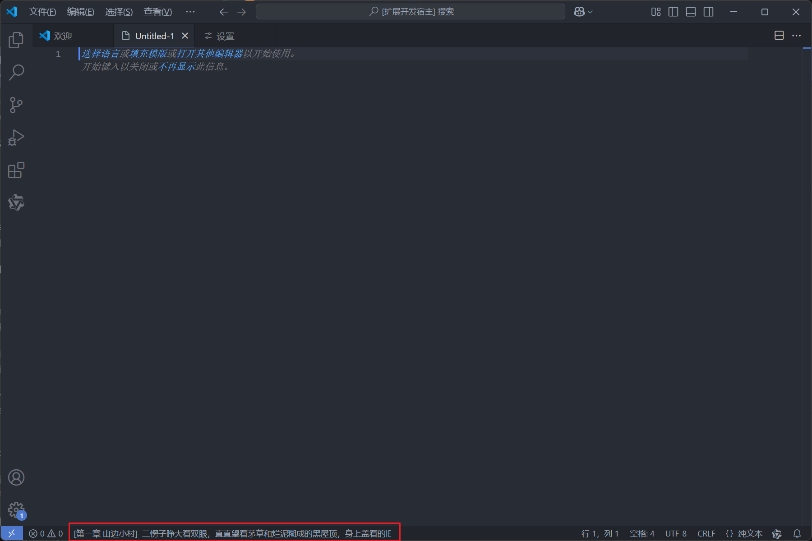

# Thief Reader

一个vscode在线看小说摸鱼神器

## 安装

- todo

## 快捷键

**MAC**

`Cmd+M` 老板键/初始化键。 显示done ，随时可用

`Cmd+;` 恢复小说内容。 文本聚焦(编辑代码)的时候，才可以使用

`Cmd+,` 上一页。 文本聚焦(编辑代码)的时候，才可以使用

`Cmd+.` 下一页。 文本聚焦(编辑代码)的时候，才可以使用

`Shift+Cmd+,` 上一章。 文本聚焦(编辑代码)的时候，才可以使用

`Shift+Cmd+.` 下一章。 文本聚焦(编辑代码)的时候，才可以使用

**WIN**

`Ctrl+ALT+M` 老板键/初始化键 。 显示done ，随时可用

`Ctrl+Alt+;` 恢复小说内容。 文本聚焦(编辑代码)的时候，才可以使用

`Ctrl+Alt+,` 上一页 。 文本聚焦(编辑代码)的时候，才可以使用

`Ctrl+Alt+.` 下一页 。 文本聚焦(编辑代码)的时候，才可以使用

`Shift+Shift+Alt+,` 上一章。 文本聚焦(编辑代码)的时候，才可以使用

`Shift+Shift+Alt+.` 下一章。 文本聚焦(编辑代码)的时候，才可以使用

**Enjoy!**